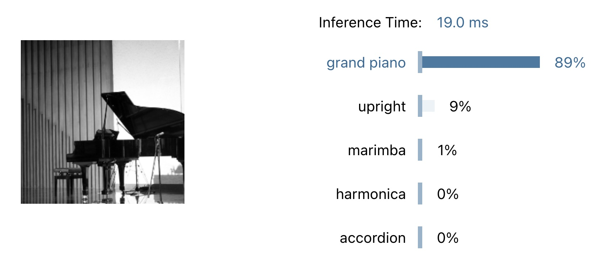
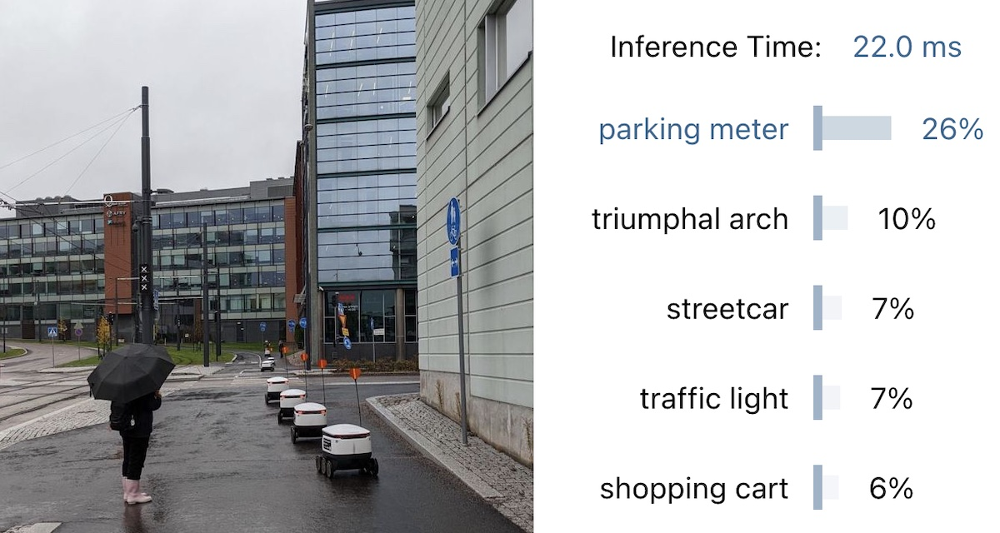

+++
author = "Roman Zaynetdinov"
date = 2023-02-27T12:00:00+03:00
title = "Run ML models locally on devices or in the browser"
description = "You can run machine learning models on user devices. Models can analyze the data without sending it to the server."
draft = false

[extra]
preview_image = "/post/run-ml-on-devices/onnx_logo.png"
+++

## Intro

Machine Learning or ML for short is a hot topic nowadays. You can see all big companies releasing huge models that allow us to do neverseen before things, generate an image from text, get an answer to your question.

When you look at the examples you can find a lot of material on how to run a model on the server side or on a special hardware. All these models work like a client-server architecture. You submit a data to your server, server analyzes your data and returns the result. With client-server architecture server has full knowledge of everything you send there.





There is a new upcoming wave of [local-first](https://www.inkandswitch.com/local-first/) software and end-to-end encrypted (E2EE) applications. They too could benefit from using ML. How do we protect users' data? 

The answer to this problem is simple: Just run the model locally.

The answer is simple but the solution is not. How would you run your model on every device? As it turns out there are several solutions. Let's start with the most obvious.

## Google MLkit

One solution that is highly popular on mobile devices is Google MLkit. It provides a good set of models and runs on Android and iOS. 

What if you want to have a desktop application? For desktops you can link tensorflow but then you will need to find a different model. What if you have a browser app? Then there is privacy concert with Google's library. It is closed source. 

> ML Kit does not send that data to Google servers.

While it doesn't collect your data it collects how you use the library.

> The ML Kit APIs may contact Google servers from time to time in order to receive things like bug fixes, updated models and hardware accelerator compatibility information. The ML Kit APIs also send metrics about the performance and utilization of the APIs in your app to Google. Google uses this metrics data to measure performance, debug, maintain and improve the APIs, and detect misuse or abuse, as further described in our Privacy Policy.
>
> **You are responsible for informing users of your app about Google’s processing of ML Kit metrics data as required by applicable law.**

Do we have any other options?

## ONNX Runtime

As it turns out we have: [ONNX Runtime](https://onnxruntime.ai/). You can run ONNX runtime everywhere: Windows, Linux, Mac, Android, iOS and Browser. This truly means that you can build cross-platform applications with it and run models locally.





You can play around with interactive examples on [this page](https://microsoft.github.io/onnxruntime-web-demo/). 

As for the models ONNX also provides a catalog of pre-built models, called [ONNX Model Zoo](https://github.com/onnx/models). *The catalog is rather limited though.* For a decent entry-level tutorial you can follow: <https://onnxruntime.ai/docs/tutorials/web/classify-images-nextjs-github-template.html>

### A catch

There is a trade-off between model results and a model size. For example MobileNet model identifies only [1000 labels](https://github.com/sonos/tract/blob/main/examples/onnx-mobilenet-v2/imagenet_slim_labels.txt). This means you might not always get good results.





Take a look at one image that I took. Every label is a miss...

> This only highlights the performance of a MobileNet model. ONNX Runtime can execute other models that could provide better results. It is up to you to pick the model that suits your needs.

## tract

One great thing about ONNX is: it is a standard. It means you can implement your own runner if you need to. One alternative runner is [tract](https://github.com/sonos/tract). It is a Rust crate that you can just import. No need to deal with C++ and linking if you don't want to or if you are building an app using Rust.

You can continue using your existing ONNX models with tract.

