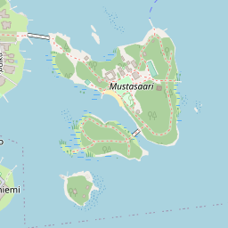
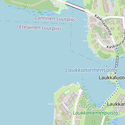
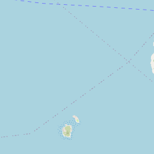

+++
author = "Roman Zaynetdinov"
date = 2023-02-09T12:00:00+03:00
title = "Set up maps on your website"
draft = false
+++

If you are like me you may needed to add a map on a website. This seems not so trivial to do!

First of all you need to pick a map source:

* Google Maps
* OpenStreetMap (OSM)
* Apple Maps
* Others

As of recently I am trying to use Google's products less and less. So let's skip that option.

OSM is big:  

> on 2023-02-01, the plain OSM XML variant takes over 1696.6 GB when uncompressed from the 123.4 GB bzip2-compressed or 67.3 GB PBF-compressed downloaded data file  
> Ref: <https://wiki.openstreetmap.org/wiki/Planet.osm>

Now that you picked the source of your map how do you display it to the user?


## Raster tiles 

[Raster tiles](https://wiki.openstreetmap.org/wiki/Raster_tiles) are pre-rendered images of a certain location.





If you want to display a map without any dependencies you can just load the needed tiles and join them together.







### Sample libraries

* [Leaflet js](https://leafletjs.com/) uses raster tiles.


## Vector tiles

If you want to be modern and cool and can take a look at [vector tiles](https://wiki.openstreetmap.org/wiki/Vector_tiles). Vector tiles are tiles that still need to be rendered.

> When using raster tiles, if you want to change the map style, you have to use a different set of tiles (often called a tile layer). Whereas with vector tiles, you can simply apply a different style to the same tiles (since the rendering happens on the client-side). 

*Seems like OSM [doesn't support this](https://github.com/openstreetmap/operations/issues/565) yet* so we will use another tiling provider for examples. Let's pick a server from [this list](https://wiki.openstreetmap.org/wiki/Vector_tiles).

Can we fetch the exact same area but as vector? I have queries both MapTiler and Qwant. Vector tiles are returned in [PBF](https://wiki.openstreetmap.org/wiki/PBF_Format) format (protobuf). Let's explore its contents:

```
$ nix-shell -p osmium-tool

$ osmium fileinfo 9484.pbf
File:
  Name: 9484.pbf
  Format: PBF
  Compression: none
  Size: 12483
PBF error: invalid BlobHeader size (> max_blob_header_size)
```

Oops... Apparently, osmium expects a complete map, like [liechtenstein-latest.osm.pbf](https://download.geofabrik.de/europe/liechtenstein.html).

In our case we just need to parse a single vector tile in mapbox format. OK let's try to read with Deno using JS libraries:

```typescript
import Protobuf from 'npm:pbf';
import { VectorTile } from "npm:@mapbox/vector-tile";
import { readFileSync } from "node:fs";

const pbf = new Protobuf(readFileSync('9484.pbf'));
const tile = new VectorTile(pbf);
console.log(tile);
```

Trimmed result:

```js
VectorTile {
  layers: {
    water: VectorTileLayer {
      version: 2,
      name: "water",
      extent: 4096,
      length: 2,
      _keys: [ "id", "class", "intermittent", "brunnel" ],
      _values: [ "ocean", 645439964, "swimming_pool", ... ],
      _features: [ 11, 927, ... ]
    },
    landcover: VectorTileLayer {
      version: 2,
      name: "landcover",
      extent: 4096,
      length: 30,
      _keys: [ "class", "subclass" ],
      _values: [ "wetland", "grass", ... ],
      _features: [ 1051, 1103, ... ]
    },
    landuse: VectorTileLayer {
      version: 2,
      name: "landuse",
      extent: 4096,
      length: 8,
      _keys: [ "class" ],
      _values: [ "playground", "residential", "pitch" ],
      _features: [ 3257, 3295, ... ]
    },
    place: VectorTileLayer {
      version: 2,
      name: "place",
      extent: 4096,
      length: 9,
      _keys: [ "name", "name_en", ... ],
      _values: [ "Haapasaari", "Aspholmen", "island", ... ],
      _features: [ 8335, 8371, ... ],
    },
    ...
  }
}
```





### Sample libraries

* <https://maplibre.org/projects/maplibre-gl-js/>


## Raster vs Vector

|               | Raster | Vector |
| ------------- | ------------- | ------------- |
| Simple  | ✓ | ⨯ |
| Size | ⨯ | ✓ |
| Customizable | *Need server to render differently* | *Change labels, styles when rendering on the client* |
| Client support | ✓ | ~ |
| Tiling server | *Can use OSM for low volume queries* | *Need to use a third-party server*[^vector-server] |

<br />
<br />

[^vector-server]: You can also set up your own server. First, download the data from OSM. Second, [convert OSM map data to vector tiles](https://github.com/onthegomap/planetiler). Finally, [host your tiles](https://github.com/maptiler/tileserver-gl).


## Apple maps

Why Apple maps? I have an Apple Developer account so I do get this kind of for free.

> MapKit JS provides a free daily limit of 250,000 map views and 25,000 service calls per Apple Developer Program membership. 


```typescript
// Import TypeScript type definition for use in Deno
import _ from "https://cdn.skypack.dev/@types/apple-mapkit-js-browser?dts";

const mapKitToken = "my-jwt-token";

// Load and init the map
const script = document.createElement("script");
script.setAttribute(
  "src",
  "https://cdn.apple-mapkit.com/mk/5.x.x/mapkit.core.js",
);
// This attribute instructs the browser to connect to the MapKit JS CDN using anonymous credentials mode.
// This improves performance by allowing subsequent MapKit JS network requests to reuse the same HTTP/2 connection.
script.crossOrigin = "anonymous";
script.dataset.libraries = "map,annotations";
script.dataset.callback = "initMapKit";
document.head.appendChild(script);

window.initMapKit = () => {
  mapkit.init({
    authorizationCallback: (done) => {
      done(mapKitToken);
    },
  });

  // Display map on the page
  const map = new mapkit.Map(document.querySelector('#map-container'));
};
```

There is a bit of a catch. Apple Maps in some areas has a lot less details.








## What to choose?

It is up to you! 

If you already have an Apple developer account then you may use Apple's maps. They provide a high daily limit for free. If you website is low traffic then you can use OSM's raster images directly. If you want maps to look a tiny bit better then you will need to pick a third party provider like <https://www.maptiler.com/>.

Google maps is also an option if you are into that sort of thing.
