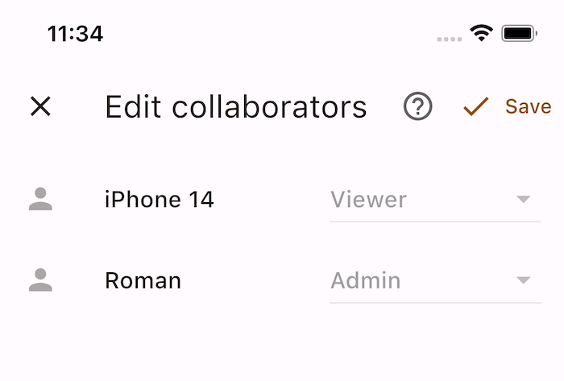

+++
author = "Roman Zaynetdinov"
date = "2023-02-03T12:00:00+03:00"
title = "How to almost build an E2EE local-first app"
description = "A few years back I started asking myself questions: Where do I want my files to be stored? Will I be able to access my files in 10 years time? Seeing all these challenges I have decided to try to build a mobile-first application that will be end-to-end encrypted, support offline editing and have an easy sharing capabilities."
draft = false

[extra]
preview_image = { href = "dog_icon.png", alt = "Bolik Timeline logo" }
+++

## Backstory

A few years back I started asking myself questions: Where do I want my files to be stored? How to synchronize files across all of my devices? Will I be able to access my files in 10 years time? Where shall I upload our family photo archive? How can I share files with my family and friends?

Naturally, file synchronization is a popular topic and there exist a lot of different solutions.

Proprietary cloud stores like Google Drive:
* ✗ Closed source
* ✗ Not encrypted (not all, e.g Mega)
* ✓ Convenient
* ✓ Wide-spread

Open-source cloud stores like NextCloud:
* ✓ Open source
* Not fully [encrypted](https://nextcloud.com/endtoend/)
* ✗ No offline editing support

Social networks like Facebook:
* ✗ Not encrypted 
* ✗ Public by default
* ✓ Easy-to-understand timeline (chronological events)

Messengers like What's App:
* Multiple chats/timelines
* ✓ Easy to share with friends and family

Folder sync like [Seafile](https://www.seafile.com/en/home/):
* ✓ Open source
* ✓ Selective sync
* ✓ Cross platform
* ✓ Sharing
* ? To access E2E encrypted folder you need to input password every hour

And a bunch more.

> There I was on the plane flying back home from a beach volleyball camp. I took a bunch of pictures and wanted to create an album. Sadly, Google Photos was kind enough to tell me that it was not possible while being offline... 

At first I started using [Syncthing](https://syncthing.net/) to sync all of my org files across devices. I was positively surprised how well it worked. In just a couple of minutes I was able to access my notes on all devices and see changes being propagated in real time.

<mermaid-block name="Syncthing architecture">
sequenceDiagram
    actor A as dev-A
    actor B as dev-B
    participant R as Relay server
    participant D as Discovery server
    autonumber
    A->>+D: Where is dev-B?
    D->>-A: dev-B's info 
    A--xB: Try to connect directly 
    A->>R: Connect to dev-B
    activate R
    R->>B: Start connection with dev-A
    B->>R: Ready
    R->>A: Channel established
    Note over A,R: Forward messages between dev-A and dev-B
    R-->>B: Done.
    R-->>A: Done.
    deactivate R
</mermaid-block>

Syncthing syncs P2P and falls back to relay server if direct connection cannot be established. But as with every technology Syncthing has limitations: 

* You have to have an always running device. Otherwise conflicts are inevitable. If you edit a file on your laptop, closed it and then opened the same note on mobile there is a high chance that that change hasn't been synced.
    I have solved it by running Syncthing on my NAS.
* Phone dies quickly if you want to run Syncthing all the time *(I haven't tried this recently because I have an always-on device)*
* It is inconvenient to select only a subset of data to sync. On mobile I don't want to keep all of my files but I do want the ability to access a certain file if needed.
* Sharing with others is limited and complex. My parents won't be able to use this.

Seeing all these challenges I have decided to try to build a mobile-first application that will be end-to-end encrypted, support offline editing and have an easy sharing capabilities.

> I am not the only one trying to build a local-first app. See other projects in the end of this blog post.

### Local-first peculiarities 

In canonical applications you would fetch the latest state from the server. That state would tell you which documents you have, which are new and which are old. Server will gladly inform you about new notifications and which notifications have been processed already by other devices.

In local-first and especially end-to-end encrypted applications everything changes. Now instead of relying on the server each client should make a decision about what to do with each document, whether to show a notification or not, can this document be trusted or not, how to fetch changed docs, etc. Through out this post I will describe how I solved some of these challenges.


## Implementation

### Conflict-free replicated data types (CRDTs)

There is a lot of literature available about what [CRDT is](#crdt-materials). I will not go into details here about this data type but essentially CRDT helps you converge the state to exact same value on all devices no matter the order of events. In other words if there is a conflict when merging two replicas then this conflict is automatically resolved to the same value everywhere.

For my implementation I am using [Yrs](https://github.com/y-crdt/y-crdt/) (a port of Y.js to Rust).

#### Why CRDT?

It allows me to have several devices modify the document concurrently. That is basically the only property I am using. There are cases where you do want to resolve the conflict manually. For example, two devices set a key to a new value in the map. Which value should be selected? While Yrs will select a single value, in some case cases we do want to prompt user to pick between two values. [Automerge](https://automerge.org/), on the other hand, can return all values for a given key. Automerge brings another potentially useful feature to the table: Automerge holds a complete history of the document so you can present a transparency log of who made which changes. *(Yrs also holds a complete history but doesn't provide convenient methods to access it)*

I store every user modifiable data type as Yrs document.

### Synchronization

*Synchronization has been my nightmare for the past couple of months. I have rewritten it a couple of times and still not fully satisfied. At the moment all clients synchronize with a single server for simplicity. I have some ideas how to go beyond that but they require a lot of time.*

Synchronization is spit into two distinct phases: device mailbox and account documents.

#### Device mailbox

Device mailbox is a simple queue with MLS group messages. A device could be invited to the group, removed from the group or device can receive an encrypted application message.

It is implemented as a stream of messages. Device must acknowledge each message explicitly for it to be removed from the server.

#### Account documents

Account documents is a collection of all documents account has access to. Every bit of information is stored as a document. Documents have schema, payload and ACL. Payload is a Yrs document. This could be Account, Account's profile, account notifications, Rich-text card, card labels, etc. Each document might have several versions in case of concurrent updates. Since documents are encrypted we can't merge them on the server, client should fetch and do the merging.

While Yrs supports applying delta updates to the document I have decided to upload a complete Yrs document every time it changes. *(There are [existing efforts](https://github.com/SerenityNotes/naisho) to build a more sophisticated solution).*

How do I know which documents have been changed remotely? How do I know which documents have been changed locally?

Both Automerge and Yrs have document synchronization algorithms built-in but those algorithms are for a single document only and assume that server stores the document unencrypted. That sadly doesn't help me much. I need to find a different solution. A stream might have worked here but I wanted something else. There are a few constraints that I placed:

* Support concurrent document updates → should store both versions
* Replace old documents with new versions
* Limit what external accounts could do

In the end it turned out that I simply need a key value store. Key value store is great because it could be implemented anywhere. It should be possible to just back up documents in user's S3 bucket. *(It is so easy to get distracted with technology. Let's continue with account documents' synchronization and a single server...)*

Let's speak about fetching remote docs. In a canonical app you would ask server to list all documents and then fetch details for a document user selected. Not in my case. I want to have full data ownership on the client side. Instead, when you open Bolik Timeline your device will fetch all changed documents and store them locally. File attachments are not automatically downloaded.

How can we figure out which documents were changed remotely? This problem is called efficient set reconsilation.

* [Efficient Set Reconciliation without Prior Context](https://www.ics.uci.edu/~eppstein/pubs/EppGooUye-SIGCOMM-11.pdf)  
   *The paper introduces an efficient data structure based on invertible bloom filter to keep track of which keys each party has. The downside is that you need to maintain that structure, otherwise just sending a complete list of keys becomes more efficient.*

I though about using some clever approach but deciced against it for now. Instead I am relying on [vector clocks](https://en.m.wikipedia.org/wiki/Vector_clock). Each device keeps a unique counter that device needs to increment every time it makes a change to any document. Each device also keeps track of all received counters from other devices. Fetching the docs becomes: return all docs from each of these devices where counter is higher than X.

Now that we know how to fetch documents, how do we push locally modified docs? We can use vector clocks for pushing as well. During fetch request server informs us what was the last counter it saw from us. Client then uploads locally modified documents with higher counter.

```protobuf
// Protobuf definition of a document upload message.
message DocMessage {
  string id = 1;
  repeated string to_account_ids = 2;
  DeviceVectorClock current_clock = 3;
  uint64 counter = 4;
  int64 created_at_sec = 5;
  string payload_signature = 6;

  oneof body {
    EncryptedBody encrypted = 7;
  }

  message EncryptedBody {
    bytes payload = 1;
    string secret_id = 2;
    repeated BlobRefMessage blob_refs = 3;
  }
}
```

Let's see a couple of examples.

<mermaid-block name="Docs on the server">
%%{init: { 'gitGraph': {'showBranches': true, 'showCommitLabel':true, 'mainBranchName': 'dev-A', 'rotateCommitLabel': false}} }%%
gitGraph
   branch dev-B
   branch dev-C
   checkout dev-A
   commit id:"A@1" tag:"doc-1"
   commit id:"A@2" tag:"doc-2"
   commit id:"A@3" tag:"doc-3"
   checkout dev-B
   commit id:"B@1" tag:"doc-4"
   checkout dev-C
   commit id:"C@1" tag:"doc-5"
   commit id:"C@2" tag:"doc-6"
</mermaid-block>

Let's say `dev-A` wants to sync. It sends a vector clock: `{ A: 3 }`. Server sees that there are two devices what are not present in the clock and sends `doc-4`, `doc-5` and `doc-6`. After fetching `dev-A`'s clock is `{ A: 3, B: 1, C: 2 }`.

<mermaid-block name="Doc on the server (update doc)">
%%{init: { 'gitGraph': {'showBranches': true, 'showCommitLabel':true, 'mainBranchName': 'dev-A', 'rotateCommitLabel': false}} }%%
gitGraph
   branch dev-B
   branch dev-C
   checkout dev-A
   commit id:"A@1" tag:"doc-1"
   commit id:"A@2" tag:"doc-2"
   commit id:"A@3" tag:"doc-3"
   checkout dev-C
   commit id:"C@1" tag:"doc-5"
   commit id:"C@2" tag:"doc-6"
   checkout dev-A
   commit id:"A@4" tag:"doc-4"
</mermaid-block>

What if `dev-A` modifies `doc-4`? It pushes the doc and also includes its vector clock which is now `{ A: 4, B: 1, C: 2 }`. Server knows that it can replace `dev-B`'s doc version with the new one. 

<mermaid-block name="Doc on the server (concurrent update)">
%%{init: { 'gitGraph': {'showBranches': true, 'showCommitLabel':true, 'mainBranchName': 'dev-A', 'rotateCommitLabel': false}} }%%
gitGraph
   branch dev-B
   branch dev-C
   checkout dev-A
   commit id:"A@1" tag:"doc-1"
   commit id:"A@2" tag:"doc-2"
   commit id:"A@3" tag:"doc-3"
   checkout dev-C
   commit id:"C@2" tag:"doc-6"
   checkout dev-A
   commit id:"A@4" tag:"doc-4"
   commit id:"A@5" tag:"doc-5"
   checkout dev-B
   commit id:"B@2" tag:"doc-5"
</mermaid-block>

What if `dev-A` and `dev-B` modify `doc-5` concurrently? Server will keep both versions.

Above I described how document synchronization works for devices in a single account. For other accounts we don't want the ability to override the documents for safety reasons. When server receives a document updates from external account it only replaces documents from that account.

#### File attachments

Each document might reference several files (blobs). Blobs are uploaded separately to an S3 bucket.

### End-to-end encryption (E2EE)

> Encryption is a by far the least familiar topic for me. I tried my best to comprehend it but please, do not take any of my opinions here as a guidance.

During my initial experiments I just tried to copy what [Matrix](https://matrix.org/) was doing. Matrix has developed [libolm](https://gitlab.matrix.org/matrix-org/olm), a library they use for E2EE. Libolm is written in C++ but luckily they have developed a next-gen version of it in Rust, called [vodozemac](https://github.com/matrix-org/vodozemac). Libolm has two main concepts: Olm and Megolm.

#### Olm

Olm is used for establishing a direct 1-to-1 channel between devices. Each device will have a single Olm channel with every other device. 

<mermaid-block name="Olm">
flowchart LR
    dev-A <--> dev-B
    dev-B <--> dev-C
    dev-A <--> dev-C
</mermaid-block>

If `dev-A` wants send a message to both `dev-B` and `dev-C` it will need to encrypt the message twice: once for `dev-B` and once for `dev-C`. Olm is very similar to what [Signal](https://www.signal.org/docs/) is doing. You can see that this becomes a lot of work in big groups. That's where Megolm comes in.

#### Megolm

Megolm solves the encryption problem in groups by encrypting the data only once and then sending the same message to all participants. Megolm session is split into two: outbound and inbound. Outbound session is used for encryption and signing the message while inbound session is used for decryption only.

Olm is used to share Megolm session keys across devices. 

<mermaid-block name="Megolm">
flowchart LR
    dev-A -. Megolm session key -.-> dev-B
    dev-A -. Megolm session key -.-> dev-C
    dev-A --> S1([Megolm session])
    S1 --> dev-B
    S1 --> dev-C
</mermaid-block>

On this diagram we can see two things. First, `dev-A` creates a new Megolm session and shares its keys with `dev-B` and `dev-C` via Olm channels. Then, `dev-A` encrypts a message with Megolm session once and sends the same encrypted message to both `dev-B` and `dev-C`.

Megolm has another useful property: if you know the session key you can decrypt all future messages from the session thus allowing access to historic messages.

At first, I started using vodozemac (libolm) in my prototypes but then I discovered yet another standard: [MLS](https://messaginglayersecurity.rocks/). What's more it seems that Matrix wants to switch to it [as well](https://arewemlsyet.com/).

#### MLS

[MLS](#mls-materials) is an upcoming standard for encryption in group communications. MLS replaces Olm and almost replaces Megolm with a single group concept. 

MLS has two types of messages *(actually more but for the sake of this example let's focus on just two)*: application messages and commits. Application messages are used for sharing application data. Commits are used for altering group state, adding or removing members. A commit transitions MLS group from one epoch to another. You encrypt a message once and forward it to all participants.

MLS provides strong security guarantees and doesn't support accessing group history for new devices. We should build this feature outselves. That's why I use MLS for secrets sharing and grouping devices into accounts only. Instead of sending application data through MLS I use [ChaCha20Poly1305](https://docs.rs/chacha20poly1305/latest/chacha20poly1305/) to encrypt the data and upload the document separately. I do lose some security guarantees but accessing history is a must have.

There is one major difficulty with MLS: it expects a total order for commits. Application messages could come in any order (this can be configured). My solution to ordering MLS commits is [Signature chain](./#signature-chain) *(described below)*.

There is still on open debate on whether to create a MLS group per document or per contact. My current approach is to have a group per contact and then share doc secrets with each contact. I found it easier to reason about but I will not now for sure until the app is being used.

OpenMLS (a Rust library) implementing MLS specification is still in-progress.

### Signature chain

Why don't I use Blockchain? It so happens that I don't use Blockchain but I do use block chain, or chain of blocks. Nowadays, a lot of of people think of Bitcoin and other crypto currencies when they hear Blockchain. Whereas underlying technology is much older. Git uses it as well.

Signature chain helps to pinpoint the correct MLS group epoch to use.

Why do you need a chain of blocks and how does it help you?
When discussing MLS I mentioned that MLS expects your commits to have a total order. Total order is not a property of eventually consistent system we are trying to build here. Signature chain helps us order group commits and specifies which MLS group epoch to use. 

Chain is a sequence of group alternation events. Each block/event either adds new members or removes existing ones.

> Why "Signature chain" name? — Each block is signed by an existing member of the group.

There are two chain variants: a signature chain for the account includes all account devices, a signature chain for two accounts includes devices from these two accounts. Whilst first chain is used to share secrets within a single account, the second is used to share secrets with other accounts.

What happens in case of a conflict? The conflict happens when two or more devices commit to the group (modify group members). In this case we pick a change from the oldest device and apply other changes a top. This is needed to also transition MLS group to correct state. 

<mermaid-block name="Signature chain conflict">
%%{init: { 'gitGraph': {'showBranches': true, 'showCommitLabel':true, 'mainBranchName': 'dev-A', 'rotateCommitLabel': false}} }%%
gitGraph
   commit id:"2eR1@1" tag:"add-A"
   commit id:"HMKb@2" tag:"add-B"
   branch dev-B
   commit id:"3o9j@3" tag:"add-D"
   checkout dev-A
   commit id:"9rYa@3" tag:"add-C"
</mermaid-block>

Let's say `dev-A` and `dev-B` each add a new device concurrently. `dev-A` adds C in a new block that has hash `309j` and `epoch=3`, while `dev-B` adds D in a new block that has hash `9rYa` and `epoch=3`. Now comes the question: which MLS group should devices use for the next update? This is where merging is useful. `dev-A` will drop B's change and reapply it thereby resolving the conflict. *(`dev-A` will do this because it is was added to the group earlier)*

<mermaid-block name="Signature chain resolved">
%%{init: { 'gitGraph': {'showBranches': false, 'showCommitLabel':true, 'rotateCommitLabel': false}} }%%
gitGraph
   commit id:"2eR1@1" tag:"add-A"
   commit id:"HMKb@2" tag:"add-B"
   commit id:"9rYa@3" tag:"add-C"
   commit id:"GCo0@4" tag:"add-D" type: HIGHLIGHT
</mermaid-block>

In the resolved chain notice that *"add-D"* hash has changed.

It is worth mentioning that Matrix is working on [decentralised MLS (dMLS)](https://arewemlsyet.com/). There isn't much info about this project but I am excited to learn more.

See also:
* <https://github.com/local-first-web/auth>
* <https://ucan.xyz/>

### Sharing and Access control list (ACL)

Signature chain is rather complex and has a few disadvantages. One of them is the need to keep a full history of the group members. When it comes to sharing a document this is a major flaw. We don't want new participants to know which accounts had access to the document before. In fact there are cases where we don't want participants to know about each other *(more on that later)*. 

I started with an idea that can I build an ACL with just a list of current members and their roles. As matter of fact it seems to be possible. So how does it work? We have three roles: Admin, Writer and Reader. Reader can only read; Writer can read and edit the document; while Admin can read, edit and modify participants. Then the ACL doc becomes a simple map from account id to the role. We send ACL doc together the content. When device receives a remote doc it consults local ACL, and merges remote content if author account id is not a Reader, and merges remote ACL if author account id is an Admin. Can you spot what may go wrong?

> I bet there are situations that break my claim. Please, do let me know!

<mermaid-block name="ACL (out-of-order)">
%%{init: { 'gitGraph': {'showBranches': true, 'showCommitLabel':true, 'mainBranchName': 'Account A', 'rotateCommitLabel': false}} }%%
gitGraph
   commit id:"A@1" tag:"add B (admin)"
   branch "Account B"
   commit id:"B@1" tag:"add C (editor)"
   branch "Account C"
   commit id:"C@1" tag:"edit doc"
</mermaid-block>

Let's say account A adds account B as Admin, then account B adds account C as Writer, finally account C modifies the doc. A fetches the docs and receives C's change first. The device can't apply it because C is not in A's ACL so A needs to hold on to this doc until it receives B change. Process it first and only after apply C's change. Phew, that's a lot of complexity...

Now we come down to what other accounts see when they receive a document share. Each account will see a full list of participants and their roles. This is useful for documents that involve collaboration, think Google Docs. But it might be problematic in other cases. 



Let's say we want to have a document with an account name and account picture. We call this Profile document. We want to share Profile with all of our contacts. The easy solution would be to just put all of our contacts as Readers. Well, if we do that then each contact will learn the full list of my contacts. This is not good.   
One solution could be to just upload the Profile doc to the server and let other accounts query for it. This might work but can we do this using existing means? In fact we can! Instead of uploading a single doc for all contacts we will upload a doc per contact with ACL of just two members: Admin and Reader.

### SQLite

SQLite is a great library for stroring user data. It comes with everything you might need: transactions, querying and search. It is one of the most used database on the client side. But it could also be used on the server side. That is exactly what I am doing. 

> How do you support rolling upgrades?

With the help of [LiteFS](https://github.com/superfly/litefs) I can have several replicas serving queries. A cluster of nodes will have a single primary node and the rest will be read-only replicas.

There is a paper that implements CRDT and syncing across replicas completely inside SQLite. I highly recommend reading it: [Build CRDTs with SQLite](https://munin.uit.no/bitstream/handle/10037/22344/thesis.pdf).

The current server side solution is temporary. In the future I want to have less reliance on a single server. 

### Flutter + Rust

I wanted UI to be cross-platform and written in a single language (not JS!). There was only one modern option that I could choose from: <u>Flutter</u>.

> Technically, there was also [compose-jb](https://github.com/JetBrains/compose-jb) from JetBrains but the project was too new, forced you to use JVM and required to write a UI on iOS in Swift.  
> I haven't yet recovered from my day-time Java job and decided to skip this option.

I played around with Flutter and was really impressed with it. At that time I had a pure Dart application and it ran the same codebase on Android, Linux, Mac and iOS. Then came a dilemma: how do I access third-party libraries written in other languages, like libolm, etc? For Olm there was [an option](https://pub.dev/packages/flutter_olm) but it required me to build a shared C++ library and somehow link it to the project. At first I was planning to go that path since I needed to do that only once.

Well, not so fast... This was only one library. How about CRDT? There are already a few great options available but they are written in JS. How would I call JS from Dart? Apparently, there is an option for that as well: [wasm](https://pub.dev/packages/wasm). 

> So are you suggesting that you wanted to execute wasm from your Flutter app just to be able to use CRDT?

Well, it also wasn't a really good option. I got really pessimistic at that moment but then I accidentally discovered that both Automerge and Y.js have Rust ports in the works! Hold on, I thought. This is actually great. I like Rust and I could use it more.

New problem: how do I call Rust from Dart? There were a [few](https://dev.to/sunshine-chain/dart-meets-rust-a-match-made-in-heaven-9f5) [resources](https://blog-appflowy.ghost.io/tech-design-flutter-rust/) available and some I even understood. Eventually, I found the silver bullet: [Flutter Rust bridge](https://github.com/fzyzcjy/flutter_rust_bridge). Flutter Rust bridge is an excellent and active project that generates type-safe glue code for calling Rust from Flutter via FFI.

Now I can use all Rust libraries from my Flutter app, so I started building. The goal was to use as much Rust as possible and use Dart only for the UI. Everything worked fine on Linux until I started cross-compiling to Android...

> Wait a minute, why does compilation fail when I use only Rust? 

Let's see what [Rustls](https://github.com/rustls/rustls) is all about.

> Rustls is a modern TLS library written in Rust. It uses ring for cryptography and webpki for certificate verification. 

OK so it is written in Rust but uses [ring](https://github.com/briansmith/ring) for cryptography and *ring* is written in a hybrid of Rust, C, and assembly language. So long Rust 👋. There are [tons](https://github.com/briansmith/ring/issues/1481) [of](https://github.com/rust-lang/rust/issues/63939) [cross-compilation](https://github.com/briansmith/ring/issues/1375) [error](https://github.com/briansmith/ring/issues/1488) reports. At this point I decided that I don't want to deal with any of these issues. I needed an easier solution. Luckily, [native TLS](https://lib.rs/crates/native-tls) just worked.

Let's move on.


## Issues

### P2P / Federation

Peer-to-peer (P2P) and federation are major topics. Each requires an additional complexity that I wasn't ready to implement for the time being. I have a couple of ideas that I want to explore:

1. Use your own S3 bucket for documents.  
   Back up documents into user-owned S3 bucket and use server only for message passing and sharing.
1. Clustering.  
   Can we connect multiple clusters together to form a federation-like protocol. See NATS super cluster and NATS account sharing.
1. Relay-based architecture, like Syncthing.  
   Relays forward messages between devices. Server optionally runs an always-on device to store encrypted backups.

### Spam

How to combat spam? Without email or phone number anyone could register as many accounts as they want. This becomes yet another email spam nightmare. There should be a mechanism to limit new accounts' sharing abilities.

### Rich-text editor

While Flutter framework is rather mature, rich text editors written in Flutter are not. There are a few editors but each has trade-offs:

* [Fleather](https://pub.dev/packages/fleather)
* [Supereditor](https://pub.dev/packages/super_editor)
* [Appflowy editor](https://pub.dev/packages/appflowy_editor)
* [Flutter quill](https://pub.dev/packages/flutter_quill)
* Build your own: there is a simplistic rich text [editor example](https://github.com/flutter/samples/tree/main/simplistic_editor/).

Ultimately, I have picked Fleather because it comes with Quill delta format support. This allows me to pass delta changes directly to Yrs' text data type. Deltas may include text, embeds (think file attachments) and text with attributes, bold, italic, etc. Sadly, there is no such thing as free cake. I will need to write a drag'n'drop support for reordering files and a few other things.

### Key backup

There is one major limitation: You have to have access to an existing device to log into your account. Fortunately, Matrix has solved this problem already and provided a lots of material on how this could be done. 

As for MLS, it is possible to join existing group via external commit. MLS allows to configure who can send messages to the group and who can modify the group. By default only group members are allowed to do that but you can enable external senders extension if you want people from outside the group to send messages and you can enable external commits. Every time MLS group is modified client exports a part of group state which later can be reused to join the group.

This is a major undertaking and currently not implemented.

### Synchronization exceptions

Earlier I have mentioned that Profile document is one exception. Instead of sending the same payload to all contacts we need to send a slightly different payload to each contact. This is not the only exception.

In addition to adding collaborators we want to remove them. With current approach if we remove a collaborator then we will not send anything to them. How will removed account learn that their access has been revoked and they will no longer receive updates? Hence we need to send a different doc payload to the removed party.

### Schema migrations

In local-first applications one does not simply upgrade the type. I am using Yrs documents but what if I want to migrate to Automerge. How would I do that? First of all you need to make sure that all of your devices have been upgraded to support Automerge and then if you have any of the documents shared you need to verify other accounts' devices too. We don't want to end up in the situation where we migrated to Automerge locally and then received a Yrs document change. We can't integrate that change anymore...


## Future plans

### Goals

* Make Bolik Timeline accessible and easy-to-use for everyone.
* My parents should be able to use the app.
* Make Bolik Timeline the primary place for cataloging your personal files.
* Implement next-gen synchronization to make the app less reliant on a single server.

### Features

List of features that I am planning to build.

* Efficient blob syncing + allow editing blobs
* Search
* Local machine-learning. Run ML models on locally all devices (e.g. tag images to allow searching by image content)
* Public cards (accessible by URL)
* File mirroring: use your own editor
* Usernames to simplify adding new contacts. Copying an account id is complex for non-technical users.
* Key backup


## Summary

It takes a lot of time and effort to build a local-first project. After doing all this work I am still not sure whether additional complexity outweighs the benefits over standard apps.

### Why not X or Y?

I like the concept of timeline. Social media and messengers have made this concept popular and easy to use. Some of the projects I have discovered only recently while already building the app.
It is hard to say why I just don't use a built product. One thing for certain is that I had this idea in my head and I am glad I explored it.

### Release

Check it out on GitHub: <https://github.com/boliktech/timeline>.

So why is this post called "How to **almost** build an app"?

You see, in the process of building the app I have realized that it is not trivial, not at all. There is a bunch of open questions, like synchronization and encryption and I just can't solve them by working secretly by myself. If you like the ideas and want to help, feel free to open an issue or start a discussion on GitHub.

There are already open betas for Android, iOS and Mac. Give them a go and share your feedback. It took a really long time to build this prototype and write this blog post. Let me know what you think!

### Logo

> A golden retriever in glasses reading a photoalbum, forest background, line art, colored, in a circle.

I have used DALLE to generate an icon my the app. Thanks to Jacob for showing [the path](https://jacobmartins.com/posts/how-i-used-dalle2-to-generate-the-logo-for-octosql/).


## Similar/interesting projects

There is a bunch of other projects that I took inspiration from.

* [Spacedrive](https://www.spacedrive.com/)
* [LoFiRe](https://lofi.re/)
* [p2panda](https://p2panda.org/)
* [Tamper-evident log](https://transparency.dev/verifiable-data-structures/)
* [Braid](https://braid.org/)
* [Block Protocol](https://blockprotocol.org/) : Schema and Web Component implementation of reusable blocks (text, code, timer, table)
* [Serenity Notes](https://www.serenity.re/en/notes)
* [Notesnook](https://notesnook.com/)
* [Standard Notes](https://standardnotes.com/)
* [Crypt.ee](https://crypt.ee/)
* [Skiff Pages](https://skiff.com/pages) (not open source)

### CRDT materials

* [CRDT papers](https://crdt.tech/papers.html)
* [A comprehensive study of Convergent and Commutative Replicated Data Types](https://hal.inria.fr/inria-00555588/document)
* [CRDT series by Bartosz](https://bartoszsypytkowski.com/the-state-of-a-state-based-crdts/)
* [CRDT series by Lars](https://lars.hupel.info/topics/crdt/01-intro/)
* [CRDT by Anton](https://medium.com/@amberovsky/crdt-conflict-free-replicated-data-types-b4bfc8459d26)

### MLS materials

* [MLS resources](https://messaginglayersecurity.rocks/)
* [How MLS Works](https://www.youtube.com/watch?v=xOMUG__uEjc)
* [MLS: Better Encrypted Group Chat](https://mrosenberg.pub/cryptography/2019/07/10/molasses.html)
* [OpenMLS](https://github.com/openmls/openmls)
